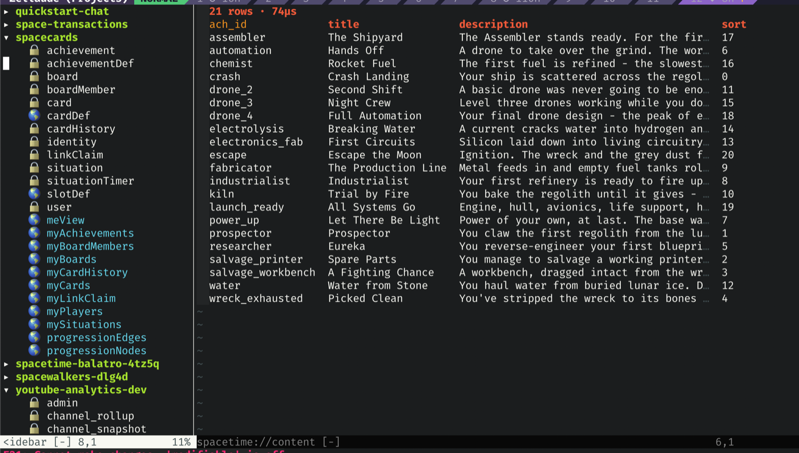

# spacetime.nvim

A [SpacetimeDB](https://spacetimedb.com) browser inside Neovim.



`:Spacetime` opens a two-window layout: a sidebar listing the databases your
identity owns, and a content window beside it. Expand a database to see its
tables, views and `st_*` system tables; press `<CR>` on one to browse its rows
as an aligned, sortable, pageable grid; describe its schema; list the module's
reducers; or tail a database's logs, either as a static backlog or followed
live.

The plugin talks to SpacetimeDB's HTTP API directly, over `curl`. It never
shells out to the `spacetime` CLI to browse — it only reads the CLI's config
file for your server list and token.

> **Status: early.** Everything in this README is implemented. Browsing is
> read-only: there is no way to write a row or call a reducer from here yet.

## Requirements

- **Neovim >= 0.11.0.**
- **`curl` on your `PATH`** — it carries every HTTP request the plugin makes.
- **A token.** Normally `~/.config/spacetime/cli.toml`, which
  `spacetime login` writes. The `SPACETIMEDB_TOKEN` environment variable or a
  `token` passed to `setup()` work just as well — see
  [How auth resolves](#how-auth-resolves).
- **No Lua dependencies.** Nothing to install alongside it; no `plenary`, no
  parser, no compiled component.

The `cli.toml` path is the XDG one on every platform, including macOS:
`$XDG_CONFIG_HOME/spacetime/cli.toml`, falling back to `~/.config/`.

Run `:checkhealth spacetime` to verify the setup. It checks the Neovim version,
the `spacetime` CLI (>= 2.0.0 — reported as an error when it is missing, since
it is how you log in, though the plugin itself never runs it), `curl`, and then
prints the same connection fields as `:SpacetimeStatus`, from the same code, so
the two cannot disagree.

## Install

With [lazy.nvim](https://github.com/folke/lazy.nvim):

```lua
{
  "krisajenkins/spacetime.nvim",
  config = function()
    require("spacetime").setup()
  end,
}
```

With [vim-plug](https://github.com/junegunn/vim-plug):

```vim
Plug 'krisajenkins/spacetime.nvim'
```

and after `plug#end()`:

```vim
lua require("spacetime").setup()
```

`setup()` is optional if you are happy with the defaults: the commands are
registered when the plugin loads, and everything else is required lazily on
first use.

The full reference is in `:help spacetime`, which says everything this README
does and is the version that ships with the plugin.

## Quick start

```vim
:Spacetime
```

That opens the full layout in the current tabpage: a full-height sidebar on the
configured side, and a content window beside it (the current window becomes the
content window, displacing whatever it was showing). Focus is left on the
sidebar. The content window shows a placeholder until you select something.

The sidebar then lists the databases belonging to your identity. From there:

- `<CR>` on a database expands it, fetching its schema once, and lists its
  tables, then its views, then SpacetimeDB's own `st_*` system tables. Each one
  is prefixed with what it is (📋 table, 👓 view, 🔧 system table) and then with
  🔒 or 🌎 for private or public.
- `<CR>` on a table or view runs `SELECT * FROM "table" LIMIT 100` and renders
  the answer in the content window as a grid.
- `s` on a table or view shows its schema there instead; `R` lists the reducers
  of the database the cursor is inside, `gl` shows that database's logs, and
  `gL` follows them live.
- `q` closes the layout and cancels anything in flight; the content window gets
  its original buffer back.
- `?` prints the sidebar's key map.

If the enclosing repository's `spacetime.json` (or `spacetime.local.json`)
names a `database`, that database is expanded for you and the sidebar cursor
starts on it — run `:Spacetime` inside a module repo and it lands where you
meant. Move the cursor and it stays put: the jump happens once, when the layout
opens, not on every refresh.

Running `:Spacetime` again re-focuses the existing layout rather than splitting
a second one, and a sidebar you have resized by hand keeps your width. The
database list and each database's schema are cached for the session; `r` in the
sidebar drops the cache and fetches again.

Each table and view is prefixed with two glyphs — what it is, then who can read
it:

| Glyph   | Means                                                        |
| ------- | ------------------------------------------------------------ |
| `▸` `▾` | A database, collapsed or expanded                            |
| 📋      | A table                                                      |
| 👓      | A view                                                       |
| 🔧      | One of SpacetimeDB's own `st_*` system tables                |
| 🔒      | Private — not readable by a connected client                 |
| 🌎      | Public — any client may subscribe to it                      |
| `⏸`     | A paused database                                            |

So `📋🔒 booking` is a private table and `👓🌎 meView` a public view. A table's
access comes from its `table_access`, a view's from `is_public`, and system
tables are marked the same way as any other. Set [`icons`](#configuration) to
`"ascii"` for `t`/`v`/`s` and `+`/`-` instead, or to `"none"` for no icon
columns at all, on a terminal with no emoji font. Every emoji here is "wide" by
Unicode, so a terminal that draws them narrow draws all of them narrow and the
names stay in one column; only the column's position moves.

A paused database answers 503 on every endpoint, so it is marked `⏸` and asked
exactly once. Press `r` on it once it has woken up.

Nothing here raises at you. An unreachable server, a rejected token, a
configuration that will not resolve and a SQL error from the server (which
arrives as plain text and is shown verbatim) are all rendered as text in the
buffer.

## Commands

| Command                     | Does                                             |
| --------------------------- | ------------------------------------------------ |
| `:Spacetime`                | Open the browser: layout plus your database list |
| `:SpacetimeToggle`          | Open the browser, or close it if it is open      |
| `:SpacetimeConnect[!] [nk]` | Switch server by `cli.toml` nickname             |
| `:SpacetimeDatabases`       | Open the browser and refetch the database list   |
| `:SpacetimeRows {tbl}`      | Browse the rows of `[db.]tbl`                    |
| `:SpacetimeSchema {tbl}`    | Show the schema of `[db.]tbl`                    |
| `:SpacetimeReducers [db]`   | List a database's reducers                       |
| `:SpacetimeLogs[!] [db]`    | Show a database's logs; `!` follows them live    |
| `:SpacetimeLogsStop`        | Stop following logs                              |
| `:SpacetimeStatus`          | Print the resolved connection                    |

Every command is `bar`-safe, so it can be chained with `|`.

There is no `:SpacetimeTables`. The sidebar *is* the table list — with the
access icons, and with the schema, the rows and the logs hanging off it — so a
second way to see the same names would be a second thing to keep true.

Where a command takes `[db.]tbl`, the database may be left off
(`:SpacetimeRows member`), in which case it is the one the connection resolved
to — usually your project's `spacetime.json`. With neither, the command says so
and does nothing. Either spelling of the table works, the source one
(`ledgerEntry`) or the SQL one (`ledger_entry`).

### Completion

`<Tab>` completes server nicknames from `cli.toml`, and database and table
names **from what the plugin has already fetched this session**. Completion
never makes a network request, so a name the plugin has not seen yet will not
appear; run the command once and it will complete thereafter.

- `:SpacetimeConnect` — nicknames from your `cli.toml`. A local file read; the
  tokens in that file are never touched.
- `:SpacetimeReducers`, `:SpacetimeLogs` — cached database names.
- `:SpacetimeRows`, `:SpacetimeSchema` — cached `db.table`, in both the source
  and the SQL spelling where they differ (`spacegym.ledgerEntry` and
  `spacegym.ledger_entry`). Only the qualified form is offered.

### `:SpacetimeConnect`

`:SpacetimeConnect maincloud` points the rest of the session at that
`cli.toml` server. It is the only way to change server without editing your
config: `setup({ server = … })`, `SPACETIMEDB_SERVER` and the project file are
all read when a connection is resolved, and this sits above all three.

Above them because it is the one source that is an *action* rather than a
setting — you typed it more recently than you wrote any of them — and it
therefore beats an explicit `host`/`port` too, from `setup()` or from the
environment. Anything else would let a `SPACETIMEDB_HOST` in your shell win
and make the command look broken. What a nickname says nothing about is left
alone: the token, and the database your project file names.

```vim
:SpacetimeConnect              " where am I, and what else is on offer?
:SpacetimeConnect maincloud    " go there
:SpacetimeConnect!             " forget it; back to what the config resolves to
```

With no argument it reports rather than switches — the server you are on, the
nickname selected if there is one, and the nicknames `cli.toml` offers. A
nickname that is not in `cli.toml` is refused with the list of the ones that
are, and **the selection does not change**: a typo cannot disconnect you.

A switch is a clean break. Everything in flight is cancelled, a log follow is
stopped, and the whole cache — the database list, every schema, every page of
rows — is dropped, because all of it is what the *old* server said. An open
layout re-resolves and refetches on the spot, and the content window goes back
to its placeholder rather than leaving another server's rows on screen. Your
expanded databases stay expanded; that is your arrangement of the tree, not
anything a server told us.

The bang is the undo, and it is the only way back when the address you started
from came from a `host`/`port` rather than a nickname you could retype.
`:SpacetimeStatus` marks a selected server, so a pasted report never names a
server that appears in none of your files.

### `:SpacetimeRows` — the grid

The badge on line one says how many rows are on screen, how far into the table
they start, and how long the server said the query took:

```
100 rows · offset 100 · 1.4ms
```

Below it: a header row, then one line per row, columns aligned by display width
so `£` and `🎟` still line up. Primary-key headers, `NULL`s, identities,
timestamps and truncated cells are highlighted.

- `s` sorts by the column the cursor is in, and again reverses it. The sort is
  on the values the server sent, not on the text they render as — `9` sorts
  before `10`, a timestamp sorts by the instant — and `NULL`s go last whichever
  way round the column is. Nothing is refetched; only the painting order
  changes, and the cursor stays on the row it was on.
- `]p` and `[p` turn the page, 100 rows at a time, by moving the SQL `OFFSET`
  and asking again. `[p` on the first page does nothing, and `]p` stops at a
  page the server returned short. Holding `]p` down is safe: every page is
  requested under the same key, so the pages you skipped are cancelled and only
  the one you land on is painted. A new page arrives in the server's order, so
  the sort applies to the page you are looking at.
- Cells wider than 40 columns are cut with a `…`, but that is the grid, not the
  data: `y` yanks the whole value of the cell under the cursor, `Y` yanks the
  row as JSON built from the values the server sent, and `K` floats every
  column of the row untruncated.

Rows are cached per table for the session (page one only); `r` in the sidebar
drops that database's rows along with its schema. Switching tables quickly is
safe: opening a second table cancels the first, and a late response is dropped
rather than painted over the table you are now looking at.

### `:SpacetimeSchema`

`:SpacetimeSchema spacegym.ledgerEntry` describes one table in the content
window: its columns with their resolved types, then its indexes and its
constraints. Views are described too — a view can have neither indexes nor
constraints, so those two sections are simply absent. Reducers are not here:
they belong to the database rather than to any one of its tables, so they have
a view of their own ([`:SpacetimeReducers`](#spacetimereducers)).

```
ledgerEntry (ledger_entry)
table · Private · 5 columns · schema v10

Columns
  entry_id        U64                 PK autoinc
  transaction_id  { __uuid__: U128 }
  security_id     String
  amount          I64
  account         Array<String>

Indexes
  ledgerEntry_entryId_idx_btree  BTree(entry_id)  accessor entryId

Constraints
  ledger_entry_entry_id_key  Unique(entry_id)
```

Where a name was written one way in the module and is spelled another way in
SQL, both are shown — `ledgerEntry (ledger_entry)`. The SQL endpoint accepts
either, so neither spelling is a trap.

Nothing in this view is truncated, and the only keys it binds are the shared
`q` and `<Tab>`. The schema is the same one the sidebar caches, so describing a
table in a database you have already expanded costs no request.

### `:SpacetimeReducers`

`:SpacetimeReducers spacegym` lists the module's reducers in the content
window. They belong to the database rather than to any one table, which is why
they are a view of their own; the sidebar's `R` opens it for the database the
cursor is inside.

```
spacegym
19 reducers · schema v10

Reducers
  ClientCallable  book(instanceId: U64) -> ok {} | err String
  Private         on_connect() -> ok {} | err String
```

Each reducer is listed with its parameter names and types and, where the server
sends them, the `ok` and `err` types it returns. A signature reads as the call
you would make, so — unlike the schema view — it names its reducer *canonically*
and once: `on_connect`, not `onConnect (on_connect)`. The schema view is where
both spellings of a name are shown.

A reducer is marked `ClientCallable` or `Private` as the server reports it, and
a `Private` one is greyed out rather than hidden: it is part of the module, it
is simply not yours to call. Older servers answer with a schema that carries no
visibility field at all, and there the marker is **omitted entirely** rather
than guessed at.

The database may be left off, in which case it is the one the connection
resolved to. Nothing here is truncated, the only keys it binds are the shared
`q` and `<Tab>`, and the schema is the same one the sidebar and the schema view
share — so listing the reducers of a database you have already expanded costs
no request.

### `:SpacetimeLogs`

`:SpacetimeLogs spacegym` puts that database's logs in the content window: the
last `log_lines` entries, oldest first, as level, timestamp and message.

```
spacegym · 11 lines · asked for 200 · level ≥ Trace
Info  2026-08-09T08:43:53.970840Z  Repairing stale view backing tables
Info  2026-08-09T08:43:53.972374Z  Disconnecting all users
```

The level is highlighted per severity, the timestamp is the same UTC rendering
a `Timestamp` column gets, and the message is shown verbatim. A line the server
sent that is not a log record is skipped silently — one malformed line never
costs you the rest of the log.

Nothing here is cached: a log tail is stale the moment it lands, so every
`:SpacetimeLogs` is a fresh request, and running it for a second database
cancels the first.

`>` raises the minimum level shown by one step and `<` lowers it, through
`Trace → Debug → Info → Warn → Error`. Neither key sends a request — the filter
is a display rule over the lines already in memory, so `<` brings back
everything it was hiding — and both stop at the ends rather than wrapping.
There is no `Panic` step: a panic outranks an error, so `Error` keeps it. The
badge always says where you are, and how much is hidden when it is hiding
anything:

```
spacegym · 3 of 412 lines · asked for 200 · level ≥ Warn
```

A level the server invented (`Verbose`, say) is shown under its own name and
ranked as `Info`, so it stays visible at the default. The filter is per view:
opening any other logs starts at `Trace` again.

**`:SpacetimeLogs!` follows.** The bang keeps the connection open and appends
lines as the server produces them; the badge then ends `· following`, or
`· stopped` once it has ended.

- The buffer is written on a 100 ms clock rather than once per line, so a
  module logging hundreds of lines a second costs ten repaints a second.
- The view keeps the last **5000** entries; older ones drop off the top. The
  cap is on what is *kept*, not on what is shown, so `<` still recovers
  everything the filter was hiding.
- The cursor is pulled down to each new last line **only if it was already on
  the last line**. Scroll up to read something and the incoming lines leave you
  alone; press `G` to start following the bottom again.

`:SpacetimeLogsStop` ends the follow and leaves the buffer as it is. The
connection is also closed when the content buffer is wiped and when Neovim
exits, so no `curl` is left running behind you. Opening any other logs — with
or without a bang — stops the follow it replaces.

### `:SpacetimeStatus`

Prints the connection the plugin has resolved for the current buffer, into
`:messages` so it can be copied out:

```
server:       maincloud (https://maincloud.spacetimedb.com:443)
identity:     c2005efe02e92547ddd4bd106e84a281ead78a30fa26f42e619d70b20917c3dd
token:        present
cli.toml:     /home/you/.config/spacetime/cli.toml
project:      /path/to/repo/spacetime.json (database: spacegym)
```

- `server` — the nickname you asked for (or the hostname, if you named one by
  hand) and the resolved base URL, whose scheme carries TLS and whose port is
  always explicit. A server chosen with `:SpacetimeConnect` says so here: it is
  the one source that is in no file, and a report that hid it would send its
  reader hunting through configuration that does not mention it.
- `identity` — your hex identity, derived from the token's claims or taken from
  the `identity` option. A derivation failure prints its reason here instead of
  aborting the command.
- `token` — always exactly `present` or `absent`. **The token is never
  printed**, not even a prefix of it; the command is meant to be safe to paste
  into a bug report.
- `cli.toml` — where the SpacetimeDB CLI's config is, with `(not found)`
  appended if there is no file there. Not having one is fine.
- `project` — the `spacetime.json` / `spacetime.local.json` at the enclosing
  repository root and the database they name, or `none`.

If the configuration cannot be resolved at all — an unknown server nickname,
say — the error appears on the `server` line and the rest is still printed.

## Keymaps

Every mapping is buffer-local; the plugin sets nothing globally.

### Sidebar

In the `spacetime://sidebar` buffer (filetype `spacetimetree`):

| Key           | Does                                                   |
| ------------- | ------------------------------------------------------ |
| `<CR>` or `o` | Expand or open the node under the cursor               |
| `s`           | Show the schema of the table or view under the cursor  |
| `R`           | List the reducers of the database the cursor is inside |
| `gl`          | Show the logs of the database the cursor is inside     |
| `gL`          | Follow those logs live                                 |
| `r`           | Refresh: drop the cache and fetch again                |
| `q`           | Close the layout                                       |
| `<Tab>`       | Move to the other window of the layout                 |
| `y`           | Yank the node's name                                   |
| `gi`          | Yank the database's identity                           |
| `?`           | Print this key map                                     |

`s`, `R`, `gl` and `gL` are the keystroke forms of `:SpacetimeSchema`,
`:SpacetimeReducers` and `:SpacetimeLogs[!]`, answered by the node under the
cursor: `s` needs a table or a view, and `R`, `gl` and `gL` take the database
the cursor is inside — from one of its tables just as well as from the database
line. Where a key does not apply it says so and does nothing. The sidebar's `s`
and the grid's `s` (sort, below) are mappings in different buffers, so they
never both apply. `R` is the capital because the lower-case `r` refreshes.

`y` and `gi` honour a register prefix, so `"+gi` puts the identity on the
system clipboard. `r` on a database node also drops that database's schema and
rows, and clears a recorded pause, which is how you retry a paused database.

### Rows

In the content window *while it is showing a grid*:

| Key     | Does                                                     |
| ------- | -------------------------------------------------------- |
| `s`     | Sort by the column under the cursor; again to reverse it |
| `]p`    | Next page (100 rows, over the SQL `OFFSET`)              |
| `[p`    | Previous page; nothing on the first one                  |
| `y`     | Yank the cell under the cursor, untruncated              |
| `Y`     | Yank the whole row as JSON                               |
| `K`     | Float the whole row, every column untruncated            |
| `q`     | Close the layout                                         |
| `<Tab>` | Move to the other window of the layout                   |

Yanks honour a register prefix (`"+y`) and your `clipboard` setting, exactly as
any other yank would. In the `K` float, `q` or `<Esc>` closes the float — that
is a mapping in the float's own buffer, so it closes the float rather than the
layout.

### Logs

In the content window *while it is showing logs*:

| Key     | Does                                   |
| ------- | -------------------------------------- |
| `>`     | Show only more severe log levels       |
| `<`     | Show less severe log levels too        |
| `q`     | Close the layout                       |
| `<Tab>` | Move to the other window of the layout |

### Schema and reducers

In the content window *while it is showing a schema or a reducer list*:

| Key     | Does                                   |
| ------- | -------------------------------------- |
| `q`     | Close the layout                       |
| `<Tab>` | Move to the other window of the layout |

The content window is shared by the four views, so each set of keys is
unbound when another view takes the buffer over. `q` and `<Tab>` are common to
all four — and to the sidebar — because the sidebar and the content window are
one thing: closing either closes both, whichever window you press it in, and
`<Tab>` crosses between them in either direction (there are two windows, so
there is nothing for a `<S-Tab>` to do). The schema and reducers views bind
nothing else: they are text, with nothing to page, sort or filter.

In most terminals `<Tab>` is the same keystroke as `<C-i>`, so this mapping
shadows jump-forward — but buffer-locally, in the plugin's two buffers only,
and only while they are on screen.

Closing never fails and never leaves one of the plugin's buffers on screen.
When the layout is all that is left of the tabpage, the last window stays open
with a buffer of yours in it — the one it displaced, failing that its alternate
(`#`), failing that a fresh empty one — rather than closing Neovim. Every
window showing a `spacetime://` buffer is dealt with, including a `:split` of
the content window, and floating windows on screen (a notification popup, say)
make no difference to any of it. A sidebar window that survives that way is
handed back as an ordinary window, its fixed width and its chrome undone.

### Buffers and windows

The two buffers are named `spacetime://sidebar` and `spacetime://content`, and
their filetypes are `spacetimetree` and `spacetime` — both stable, so you can
hang your own autocommands and mappings off either.

A window is held to `nowrap` while it is showing one of them, and gets its own
`wrap` back the moment it shows anything else — `q`, `:edit`, `:bdelete`, any
route out. Every view here is column-aligned, and one wrapped line shunts every
line under it out of true. The content window is your window; the layout only
borrows it, so nothing global is touched: `sidescroll`, the obvious companion
to `nowrap`, is a global option and is left exactly as you set it. The `K` row
float is the exception — it wraps, because it exists to show a value whole.

The sidebar window is additionally `winfixwidth`, with `number`,
`relativenumber` and `signcolumn` off — the four it gives back when it is the
window left standing.

## Configuration

`setup()` takes an optional table. Every field is optional.

```lua
require("spacetime").setup({
  log_level = vim.log.levels.INFO,
  identity = nil,
  side = "left",
  width = 30,
  log_lines = 200,
  icons = "emoji",
})
```

- **`log_level`** — minimum severity for the plugin's own `vim.notify()`
  messages. A `vim.log.levels` value; the default is `INFO`. Applied to the
  logger at `setup()` time rather than stored.
- **`identity`** — your hex identity, as a string. The escape hatch: it skips
  the derivation from your token's claims entirely, so a bad derivation can
  never fully block you. Normally you should not need it — the identity is
  computed from the token — but `:SpacetimeStatus` will tell you when it cannot
  be, and this is how you supply it by hand.
- **`side`** — which side of the tabpage the sidebar opens on: `"left"` (the
  default) or `"right"`. Anything else is rejected at `setup()` time.
- **`width`** — how wide the sidebar is: a positive number of columns (`30` by
  default), or a percentage of the screen as a string, e.g. `"20%"`. A
  percentage is resolved against the terminal's current width each time the
  layout is opened. The result is never narrower than 10 columns and always
  leaves at least one column for the content window. The width is applied when
  the sidebar is created, so one you have dragged wider survives a re-open.
- **`log_lines`** — how much log backlog `:SpacetimeLogs` asks the server for
  (`200` by default). Any whole number of lines, zero or more; a fraction, a
  negative or a string is rejected at `setup()` time.
- **`icons`** — how the sidebar marks what an entry is and who can read it:
  `"emoji"` (the default) uses 📋 👓 🔧 and 🌎 🔒, `"ascii"` uses `t` `v` `s`
  and `+` `-` for a terminal with no emoji font, and `"none"` drops both
  columns entirely. Anything else is rejected at `setup()` time. The setting is
  read on every render, so changing it and refreshing with `r` is enough to see
  it.

`setup()` also accepts the connection fields `host`, `port`, `tls`, `server`,
`database` and `token`. They sit at the top of the precedence chain below, and
are the only way to pin a connection from your Neovim config rather than from
the environment or a project file. They are stored as given and not
validated at `setup()` time — a bad value surfaces when a connection is next
resolved, on `:SpacetimeStatus` or in the sidebar.

### Highlights

Every group is defined as a `default` link, so a colourscheme that defines one
itself wins, and you can re-link any of them without patching the plugin:

`SpacetimeHeader`, `SpacetimeDatabase`, `SpacetimeTable`, `SpacetimeView`,
`SpacetimeSystemTable`, `SpacetimeNull`, `SpacetimePrimaryKey`,
`SpacetimeSpecial`, `SpacetimeTruncated`, `SpacetimeError`, `SpacetimePaused`,
and one per log level: `SpacetimeLogPanic`, `SpacetimeLogError`,
`SpacetimeLogWarn`, `SpacetimeLogInfo`, `SpacetimeLogDebug`,
`SpacetimeLogTrace`.

## How auth resolves

Which server, which database and which token a buffer means is decided by five
sources, consulted in one fixed order — highest first:

```
:SpacetimeConnect  >  setup() opts  >  environment  >  spacetime.local.json  >
spacetime.json  >  cli.toml
```

The environment variables read are `SPACETIMEDB_HOST`, `SPACETIMEDB_PORT`,
`SPACETIMEDB_SERVER`, `SPACETIMEDB_DATABASE` and `SPACETIMEDB_TOKEN`. There is
no variable for TLS.

**The address.** In order:

0. A server selected with [`:SpacetimeConnect`](#spacetimeconnect) replaces the
   address outright — it is an action rather than a setting, so it outranks
   even an explicit `host`. It lasts the session, or until
   `:SpacetimeConnect!`. Everything below describes what you get without one.
1. An explicit `host` or `port` — from `setup()` or from `SPACETIMEDB_HOST` /
   `SPACETIMEDB_PORT` — or `tls = true` from `setup()` wins outright and
   suppresses `cli.toml` and the project files *entirely*, even when the values
   happen to equal the defaults. Whatever of the three is missing defaults to
   `localhost`, port `3000` and no TLS.
2. Otherwise a **nickname** (`setup({ server = … })`, `SPACETIMEDB_SERVER`, or
   the project file's `server`) is looked up in `cli.toml`'s
   `[[server_configs]]` blocks. A nickname that is not there is a hard error —
   the message lists the nicknames that are — whatever supplied it, and so is a
   nickname with no `cli.toml` at all to resolve it against. Silently
   connecting somewhere else would be worse.
3. Otherwise `cli.toml`'s `default_server`, or the conventional `local` when
   that key is absent. A `default_server` naming a block that does not exist is
   *not* an error; it falls through.
4. Otherwise `localhost:3000` without TLS.

A server's port comes from its protocol — 443 for `https`, 80 for `http` — not
from 3000. 3000 is the local-server default, and it only applies when you named
a host by hand.

**The token** is `setup({ token = … })`, else `SPACETIMEDB_TOKEN`, else
`cli.toml`'s `spacetimedb_token`. That last one is what `spacetime login`
writes, and is the normal case. The token is sent to `curl` on stdin rather
than in its argv, so it is not visible in `ps`, and the plugin's own log output
redacts it.

**The identity** — needed to list your databases at all — is taken from
`setup({ identity = … })` if you set it, and otherwise derived from the token:
its legacy `hex_identity` claim when it has one, else BLAKE3 over the `iss` and
`sub` claims. This is why every identity you see starts `c200`.

### Project files select the database

A repository usually knows which database it means. Starting from the current
buffer's directory (or the working directory, for an unnamed buffer), the
plugin walks up to the nearest directory containing `.jj` **or** `.git` and
reads two files there:

```
spacetime.json          committed; the project's defaults
spacetime.local.json    usually .gitignore'd; overlaid on top, key by key
```

Only `server` and `database` are read from them — `module-path`, `generate` and
`dev` belong to the CLI's build flow and are ignored. `server` is a `cli.toml`
nickname, so it resolves *through* the chain above rather than around it. A
missing, unreadable or malformed project file contributes nothing and is never
an error.

```json
{
  "server": "maincloud",
  "database": "spacegym"
}
```

With that in your repo, `:Spacetime` opens on `maincloud` with `spacegym`
already expanded, `:SpacetimeRows member` needs no database prefix, and
`:SpacetimeLogs` with no argument tails `spacegym`.

The connection is resolved from **the buffer you ran the command in**, before
the layout displaces it — which is what makes "run `:Spacetime` in a module
repo and land on its database" work. `:SpacetimeStatus` reports the resolution
for the current buffer, project files and all.

## Development

The project uses Nix for its toolchain. `direnv` picks the shell up
automatically; otherwise:

```bash
nix develop
```

That provides `neovim`, `lua-language-server`, `luacheck`, `stylua`, `curl` and
the `spacetime` CLI.

```bash
make                                      # typecheck + test (the default target)
make test                                 # tests only
make test_file FILE=tests/test_main.lua   # one test file
make typecheck                            # luacheck + lua-language-server
make format                               # stylua
make check-format                         # stylua --check (what CI runs)
make helptags                             # regenerate doc/tags after editing doc/
```

Tests use [mini.test](https://github.com/echasnovski/mini.test); `make` clones
it into `deps/` on first run.

### Nix pins

`overlays/` pins Neovim and SpacetimeDB ahead of what nixpkgs 26.05 ships.
SpacetimeDB installs upstream's release binaries, so it is a download rather
than a build. Neovim is an `overrideAttrs` on nixpkgs and does compile, so a
cold `nix develop` takes a while — CI caches the resulting store (see
`.github/workflows/ci.yml`).

## Licence

MIT. See [LICENSE](LICENSE).
